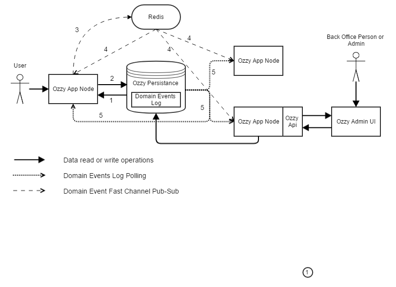

# Architecture

## Background

## Event-driven architecture
Ozzy framework realizes event-driven approach to architecture of complex backend systems.
This provides following benefits
- It helps organize processing logic of application around handling domain events
- Keeps Audit Log of what happened with the system ([see Domain Event pattern explanation by Martin Fowler](https://martinfowler.com/eaaDev/DomainEvent.html))
- Enables an application to maintain data consistency across multiple services without using distributed transactions [see](http://microservices.io/patterns/data/event-driven-architecture.html)
- Drastically simplify integrations with other system
- Simplifies adoption of [CQRS](https://martinfowler.com/bliki/CQRS.html) in the system but not mandates it

## Big Picture
From big picture perspective Ozzy applications consists of following main components
- Cluster of one or more **Ozzy App Nodes** which perform data processing in the application. Single Ozzy Node usually represented by single ASP.NET Core application.
- **Ozzy Persistence** which maintain Source of Truth in the system and usually represented by some transactional Database system which stores system state and Domain Events Log. List of supported Databases are in the [Ozzy Persistence]() section.
- Optional additional services which support additional features of the Ozzy framework or improves performance of some system usage scenarios. Most obvious example of such service is [Redis](https://redis.io/) cluster which can provide some useful features like fast caching, distribute locks, queues and used by Ozzy to reduce latency of Domain Event Log polling scenarios.
- **Ozzy API** which is optional feature that can be configured for some Ozzy App Nodes and provides API for managing Ozzy settings, Ozzy Cluster state or other data exposed with help of Ozzy framework.
- **Ozzy Admin UI** is frontend web application which uses Ozzy Api and provides UI for managing Ozzy & Application settings and data by back office persons, e.g. system administrator or content manager.

In this picture Ozzy App Node on the left is used by the user of application. It is up to your application how this communication is realized. E.g. your application can be Web Application implemented with MVC framework or Mobile App which uses Nancy powered API exposed from your backend. This Ozzy App Node can read and write data from Ozzy Persistance Database and Ozzy framework provides special Base Classes for this dependent on Ozzy Persistance Database type (e.g. for SQL databases it is usually EntityFramework Core powered). These Base Classes provides ability to save and publish Domain Events as part of changing state of your application.

When your application is updating its state in Ozzy Persistance, corresponding Domain Events are raised and saved consistently with updated state in the Domain Events Log. Then this Domain Events Log is polled by all the Ozzy App Nodes in the Cluster and new events which were raised by the state modification operation can be handled by the system. Saving domain events as part of change state operation provides consistency and durability of Domain Events. But polling of Ozzy Persistance database for these events introduces additional latency because usually poll periods should not be very short (e.g. not less than 1 second) to not overload database.
In order to keep latency low and handle domain events publishing in more efficient way (than db polling) Ozzy application can use so called "fast channel" for publishing domain events. In this picture Redis (namely its pub/sub message broker feature) used for fast channel. Domain Events still saved to Ozzy Persistence but at the same time (when save transaction is committed) same events are published to Redis pub/sub broker. All other nodes are subscribed to this fast-channel and can obtain new domain events with minimal latency and performance overhead. Actually during normal operation most of the events will be received by nodes via fast-channel and Ozzy is smart enough to not poll the database in this case. In case of some problems with fast-channel (e.g. your Redis nodes are down) Ozzy Nodes will automatically use durable polling of events ensuring that no events will be lost during publishing to the nodes.

Same data processing flow is used with Admin UI. When Admin UI application is updating application state via Ozzy Api then Domain Events are raised and published by the same infrastructure across all Ozzy Nodes and are handled there. This how Cluster-wide control commands are implemented. 

So finally let's summarize main Ozzy data processing flow:
1. Currents state of application can be read from Ozzy Persistance Database.
2. Application updates it's state and corresponding domain events are saved to Domain Events Log consistently as single transaction. If your transaction failed (e.g. when the same data was changed from another operation and you received optimistic concurrency violation exception) none of events will be saved.
3. If the save operation succeeds than raised Domain Events are published to Redis pub/sub broker.
4. Redis in-memory message broker pushes these events to all Ozzy App Nodes
5. If Redis fast-channel is down then raised events will be polled from Ozzy Persistance Database by all Ozzy Nodes.

At this point application can handle events raised in the system. Ozzy framework provides infrastructure for implementation of reliable event handlers. They can as simple as just logging what happened in the system or as complex as asynchronous workflow managers (read Saga). And of course during the handling of event application state can be modified and new Domain Events will be raised and published in the system.
