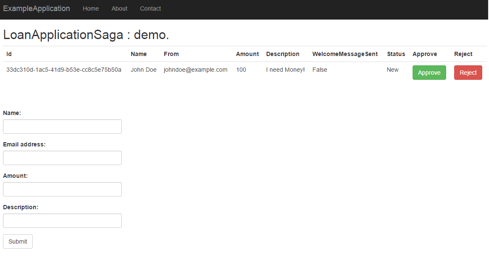

# Walkthrough: Create your first application with Ozzy

## What will we do
In this walkthrough we will create simple Loan Application service. Users will be able to create new application from Web UI. Next these applications will follow special handling process which will include 
* Sending Email back to applicant with confirmation
* Sending notification to administrator about new loan application received
* Manual approval of application by administrator. Administrator can see all applications in the Web UI and approve/reject them

For this walkthrough we are going to use Sql Server via Entity Framework Core as persistence mechanism. Entities will be saved in tables as in classic ORM approach.
To start you will need to follow these steps:
* Prepare infrastructure to use Ozzy features
* Create LoanApplication Domain Model with business logic of handling loan applications
* Create MVC controller and view to expose this model with web UI
* Create Ozzy Saga to orchestrate loan application events into process of handling loan applications.

Resulting application can be found and downloaded [here](https://github.com/sashaozz/Ozzy/tree/master/ExampleApplication) 

## Prepare Infrastructure
### Install nuggets
We will need following nuggets:
* Ozzy.Server - Core functionality of Ozzy App Node to use in your application
* Ozzy.Server.EntityFramework - Implementation of Ozzy Persistance to Entity Framework Core compatible databases
* Microsoft.EntityFrameworkCore.SqlServer - As far as we will use Sql Server as our Entity Framework Core compatible database for Ozzy Persistance

You can obtain latest Ozzy nugets from [this myget feed](https://www.myget.org/F/sashaozz/api/v3/index.json). Please take in mind that nugets on this feed are pre-release versions so don't' forget to mark "Include Prerelease" box in Visual Studio.

### Setup appSettings.config
Setup your connection string to database as usual in `appsettings.json`
```
  "ConnectionStrings": {
    "SampleDbContext": "Data Source=.;Initial Catalog=loan-service-test;Integrated Security=True;"
  }
```
It is not needed to have this database created now, we will create it automatically later in this walkthrough using EF Core migrations.

### Setup database context

First we have to create our Ozzy persistance Domain Model to save entities and Domain Events. Create `SampleDbContext` class derived from `AggregateDbContext` which is base class for Entity Framework compatible Ozzy persistance. It is derived from standard Entity Framework database context and enhanced to store Ozzy Domain Events consistently with other entities persisted to database.

```
public class SampleDbContext : AggregateDbContext
{
    public SampleDbContext(IExtensibleOptions<SampleDbContext> options) : base(options)
    {
    }
}
```
### Configure Ozzy Domain Model
Next we will have to configure Ozzy infrastructure. It is done the same way as most ASP.NET Core configuration in the `Startup.cs` in the `ConfigureServices` method. First we have to register our Ozzy Domain Model using `services.AddOzzyDomain<TDomainModel>` method. Here we can also configure additional setting how our Domain Model will work. E.g in this walkthrough we will use SqlServer as Entity Framework database and in-memory fast channel for publishing domain events. It is also register Ozzy-related services in the DependencyInjection infrastructure.

```
services.AddOzzyDomain<SampleDbContext>(options =>
{
    options.UseInMemoryFastChannel();    
})
.UseEntityFramework((options =>
{
    options.UseSqlServer(Configuration.GetConnectionString("SampleDbContext"));
}));
```
Basically this configuration enables your application to resolve Ozzy Domain Model specific services and use them to persist and read your data and domain events.

### Configure Ozzy App Node

Next we have to register Ozzy App Node and specify that this node will use `SampleDbContext` as main model for persistance and cluster-wide commands.
```
services.AddOzzyNode<SampleDbContext>(options =>
{
    options.UseSqlServerQueues();
});
```
Basically this configuration enables your application to resolve Ozzy App Node specific services and use them in your applications. These services are aware of Ozzy Cluster configuration and can distribute their operations across cluster. Here for example we are registering additional queues service which will use same Sql Server as persistance storage. All nodes in the cluster should use same Ozzy Domain Model for cluster-wide commands. 

### Start Ozzy node

Finally when all the services are registered we can resolve Ozzy App Node and start it. 

```
app.UseOzzy().Start();
```

When Ozzy Node is started it will try to join cluster and start executing Ozzy related tasks like Background Processes, Sagas and Listening ot Domain Events.

### Infrastructure Overview
At this point we have fully functional Ozzy Node and we can start using its features like
* Saving Domain Events and listening for them
* Sagas
* Background Processes
* Queues
* etc

Next we will create Domain Model which will implement logic of our Loan Application service.

## Create Domain Model and provision database
First we will create our `LoanApplication` aggregate which will represent loan applications in the system. They will have `Name` and `From` email address of applicant, requested `Amount` of the loan and general `Description`. `LoanApplicationStatus` will represent status of processing of applications.
```
public enum LoanApplicationStatus
{
    New,
    Approved,
    Rejected
}

public class LoanApplication : AggregateBase<Guid>
{
    public string Name { get; protected set; }
    public string From { get; protected set; }
    public string Amount { get; protected set; }
    public string Description { get; protected set; }

    public bool WelcomeMessageSent { get; protected set; }
    public LoanApplicationStatus Status { get; protected set; }

    public LoanApplication(string name, string from, string amount, string description) : base(Guid.NewGuid())
    {
        Name = name;
        From = from;
        Amount = amount;
        Description = description;
        Status = LoanApplicationStatus.New;

        this.RaiseEvent(new LoanApplicationReceived
        {                
            ApplicationId = Id,
            Name = Name,
            From = From,
            Amount = Amount,
            Description = Description
        });
    }

    // for ORM
    protected LoanApplication()
    {
    }    
}
```
Basically it is implemented as standard Entity Framework styled DDD-aggregates. Ozzy Framework doesn't restrict how you would like to model your entities.

What is important here is  usage of `RaiseEvent` method which will raise and save `LoanApplicationReceived `Domain Event. This event will be persisted to the database in the same transaction with `LoanApplication` entity.

Similarly we will add business logic related to approval pf applications to our aggregate. 
```
public void Approve()
    {
        if (Status != LoanApplicationStatus.New) throw new InvalidOperationException("wrong application status");
        Status = LoanApplicationStatus.Approved;
        this.RaiseEvent(new LoanApplicationApproved
        {
            ApplicationId = Id
        });
    }

    public void Reject()
    {
        if (Status != LoanApplicationStatus.New) throw new InvalidOperationException("wrong application status");
        Status = LoanApplicationStatus.Rejected;
        this.RaiseEvent(new LoanApplicationRejected
        {
            ApplicationId = Id
        });
    }

    public void MarkApplicationAsWelcomeMessageSent()
    {
        WelcomeMessageSent = true;
    }
```
### Update Entity Framework mappings
Finally we have update our `SampleDbContext` with mappings for new `LoanApplication` entity. It is common operation for Entity Framework Code-first approach.

```
public DbSet<LoanApplication> LoanApplications { get; set; }

protected override void OnModelCreating(ModelBuilder modelBuilder)
{
    modelBuilder.Entity<LoanApplication>().HasKey(c => c.Id);

    base.OnModelCreating(modelBuilder);
}
```

### Create database with Entity Framework migrations
Now when our Domain Model is ready we will provision database for this model with EF migrations. We will use [.Net CLI tools](https://docs.microsoft.com/en-us/ef/core/miscellaneous/cli/dotnet) for this but you ca use other supported EF Core migration tools like Package Manager Console. Read more about EF Core migrations in the Entity Framework documentation.

With .Net CLI tools you have to run just 2 commands
```
dotnet ef migrations add init
```
to create first migration in your project. And
```
dotnet ef database update
```
create database and update it to the latest migration.

### Domain Model Overview
we've created Domain Model of our Loan Application service. It was not really Ozzy specific as framework doesn't restrict you how to model your application data model. But from this model important events are published and can be easily consumed from Ozzy-enabled applications.

Next we will expose our Domain Model in the Web UI with help of standard MVC implementation bundled in the ASP.NET Core framework.

## Lets expose our domain model with MVC 
LoanApplicationsController
```
public class LoanApplicationsController : Controller
{
    private Func<SampleDbContext> _dbFactory;

    public LoanApplicationsController(Func<SampleDbContext> dbFactory)
    {
        _dbFactory = dbFactory;
    }
}
```
Your can see how instances of your SampleDbContext can be resolved from DI. Ozzy automatically register `SampleDbContext` (for per-request access) and `Func<SampleDbContext>` (for transient access) in the container.
First we will create actions to list all applications and create new one.

```
public IActionResult Index()
{
    using (var dbContext = _dbFactory())
    {
        var data = dbContext.LoanApplications.ToList();
        return View(data);
    }
}

[HttpPost]
public IActionResult Index(LoanApplicationViewModel model)
{
    using (var dbContext = _dbFactory())
    {
        var application = new LoanApplication(model.Name, model.From, model.Amount, model.Description);
        dbContext.LoanApplications.Add(application);
        dbContext.SaveChanges();
    }

    return Redirect("/LoanApplications");
}
```
Then we will add actions to Approve and Reject applications
```
public IActionResult Approve(Guid id)
{
    using (var dbContext = _dbFactory())
    {
        var application = dbContext.LoanApplications.First(app => app.Id == id);
        application.Approve();
        dbContext.SaveChanges();
    }
    return Redirect("/LoanApplications");
}

public IActionResult Reject(Guid id)
{
    using (var dbContext = _dbFactory())
    {
        var application = dbContext.LoanApplications.First(app => app.Id == id);
        application.Reject();
        dbContext.SaveChanges();
    }
    return Redirect("/LoanApplications");
}
```
### Lets display our applications with MVC views
It is actually so straightforward that we will not copy code for LoanApplications view here. Anyone can check this code in the Sample Application project. Please see [LoanApplications/Index.cshtml](https://github.com/sashaozz/Ozzy/blob/master/ExampleApplication/Views/LoanApplications/Index.cshtml)

Finally we will have view like this for Loan Applications


## Ozzy Sagas to handle application lifecycle workflow

So before most of the things were not really Ozzy specific. We consider this as another advantage of Ozzy opinionated design : you can implement your application in the way you like, no restrictions from framework.

Next we will use Ozzy Sagas to implement workflow which will handle loan application lifecycle. Sagas actually are implementation of [Process Manager](http://www.enterpriseintegrationpatterns.com/patterns/messaging/ProcessManager.html) pattern, you can check more information about it for example [here](https://msdn.microsoft.com/en-us/library/jj591569.aspx). Idea is that sagas can subscribe for selected application events related to some process (e.g. loan application handling) and orchestrate these events by saving process progress in it's own state which is called SagaState. When saga handle particular event related to process it can do arbitrary things like creating/modifying entities (which in turn can result in publishing new Domain Events) or communicating with other modules of the system or external systems.

```
public class LoanApplicationSaga : SagaBase<LoanApplicationSagaData>        
{

    private Func<SampleDbContext> _dbFactory;

    public LoanApplicationSaga(Func<SampleDbContext> dbFactory)
    {
        _dbFactory = dbFactory;
    }
}
```
Now we have to register our `LoanApplicationSaga` with our Ozzy Domain Model configuration so domain events which will be published in this model could be directed to this Saga automatically.

```
services.AddOzzyDomain<SampleDbContext>(options =>
{
    options.UseInMemoryFastChannel();
    options.AddSagaProcessor<LoanApplicationSaga>();
})
.UseEntityFramework((options =>
{
    options.UseSqlServer(Configuration.GetConnectionString("SampleDbContext"));
}));
```
Sagas are invoked when some Domain Event related to the saga process happened in the system. To start listening on particular event types saga should implement `IHandleEvent<TDomainEvent>` interface. Now we will update our `LoanApplicationSaga` to react on `LoanApplicationReceived` event. In the loan application workflow after application entity was captured we would like to send emails : 1) to applicant with confirmation that its application was successfully received and 2) to the administrator of the system with notification that new application is ready for check.
```
public class LoanApplicationSaga : SagaBase<LoanApplicationSagaData>,
    IHandleEvent<LoanApplicationReceived>
{

    private Func<SampleDbContext> _dbFactory;

    public LoanApplicationSaga(Func<SampleDbContext> dbFactory)
    {
        _dbFactory = dbFactory;
    }

    public void Handle(LoanApplicationReceived message)
    {
        State.ApplicationId = message.ApplicationId;

        SendSagaCommand(new SendWelcomeEmail(this)
        {
            Name = message.Name,
            Email = message.From,
            Amount = message.Amount,
            Description = message.Description

        });
        SendSagaCommand(new SendNotificationToAdministrator(this)
        {
            Amount = message.Amount
        });
    }
}
```
As you can see we implemented this by issuing to distinct commands `SendWelcomeEmail` and `SendNotificationToAdministrator`. Why is this better than trying to send email directly from `LoanApplicationReceived` handler? The answer is that this way these commands will be handled independently and can be reliably retried or compensated in case of faults. SagaCommands are just events inherited from `SagaCommand` base class which holds SagaId with it to be dispatched to correct saga instance.
```
public class SendWelcomeEmail : SagaCommand
{
    public Guid ApplicationId { get; set; }

    public string Name { get; set; }
    public string Email { get; set; }
    public string Amount { get; set; }
    public string Description { get; set; }

    public SendWelcomeEmail(LoanApplicationSaga saga) : base(saga)
    {
        ApplicationId = saga.State.ApplicationId;
    }
    public SendWelcomeEmail()
    {
    }

}

public class SendNotificationToAdministrator : SagaCommand
{
    public Guid ApplicationId { get; set; }

    public string Amount { get; set; }

    public SendNotificationToAdministrator(LoanApplicationSaga saga) : base(saga)
    {
        ApplicationId = saga.State.ApplicationId;
    }
    public SendNotificationToAdministrator()
    {
    }
}
```
Let's add handlers for these commands to `LoanApplicationReceived`
```
public void Handle(SendWelcomeEmail message)
{
    //TODO: Add call to real smtpClient or other email service            
    using (var dbContext = _dbFactory())
    {
        var application = dbContext.LoanApplications.First(m => m.Id == State.ApplicationId);
        application.MarkApplicationAsWelcomeMessageSent();
        dbContext.SaveChanges();
    }
    State.WelcomeEmailSent = true;
}

public void Handle(SendNotificationToAdministrator message)
{
    //TODO: Add call to real smtpClient or other email service
    State.AdminNotificationEmailSent = true;
}
```
Ok now our loan application is captured and email notifications are sent. Next we will show how saga can handle asynchronous workflows easily. In our example loan applications should be approved or rejected by administrator manually hence saga cannot wait for this event synchronously. It will react on `LoanApplicationApproved` or `LoanApplicationRejected` event. 
```
public void Handle(LoanApplicationApproved message)
{
    State.IsComplete = true;
}

public void Handle(LoanApplicationRejected message)
{
    State.IsComplete = true;
}
```
Same with behavior should be used when your saga is integrated with asynchronous external services, e.g. automated application verification service (which can fail or take too much time to complete). You should trigger external operation from you saga and handle result in another event handler when operation will be finished.

## Further reading
So we have implemented simple loan application service using Ozzy Domain Events and Sagas. In the next samples we will extend this service with help of Ozzy queues to scale Email sending to multiple nodes and show how to manage loan applications from Ozzy BackOffice UI.